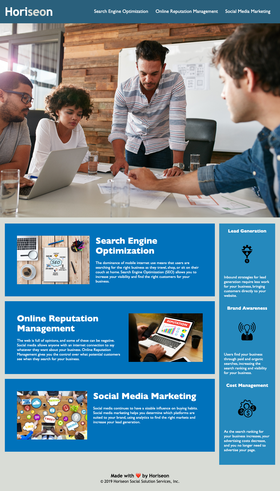

# Challenge-1-SEO

## Description

This is my initial project "challenge" for a coding boot-camp. This project was a revision of existing code. The assignment was to complete the following: 

- Ensure code works as designed (links, image size, formatting, etc.)
- Clean up any excess code in CSS. 
- Add comments to help maintain in future. 

## Installation

N/A

## Usage

This can be used as a reference for coding comments, scroll links, and more basic functions. Also can be used to reference down the road to see where I started coding. 

## Credits

Referenced for adding comments in CSS: https://github.com/necolas/idiomatic-css

## License

Licensed under the  license.

## Tests

Inspect the elements with Chrome devtools to find comments that describe section purposes. 